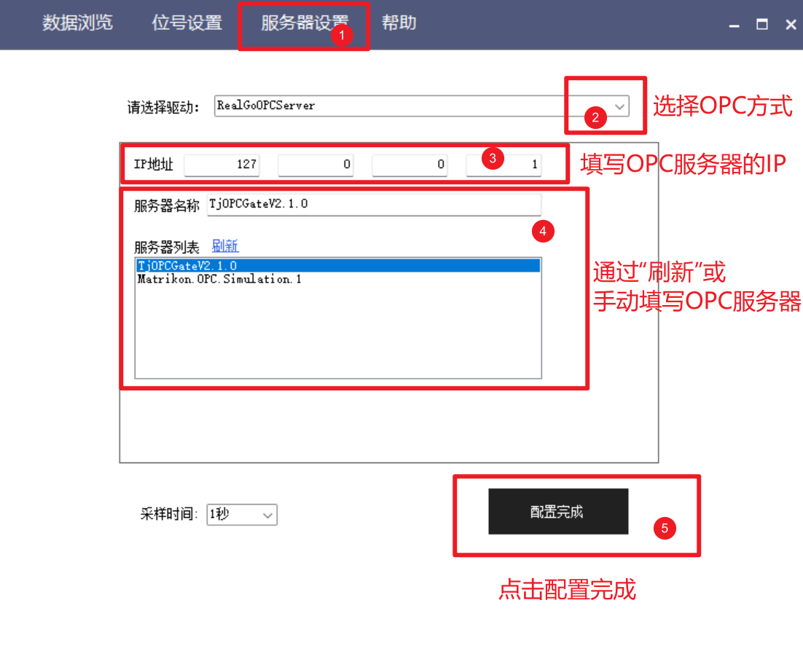
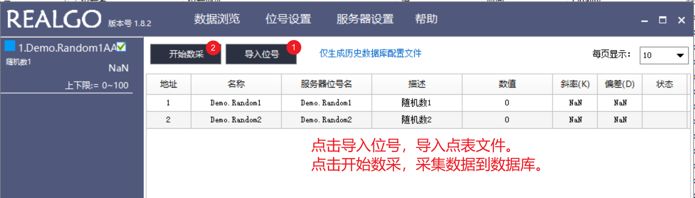
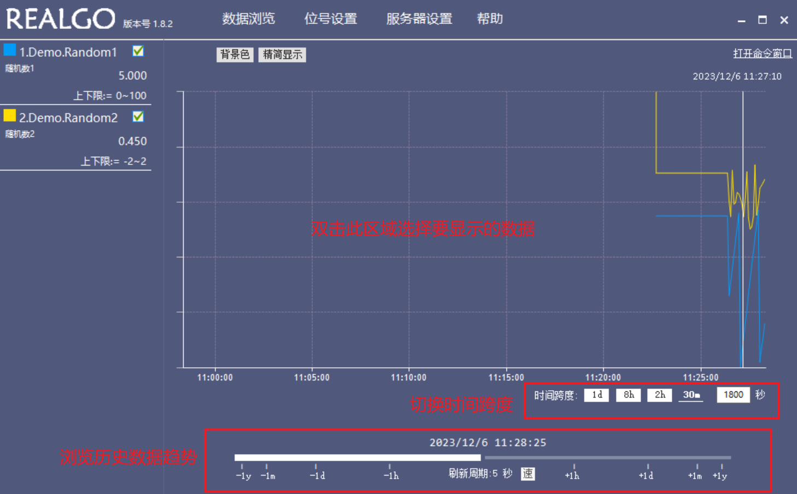
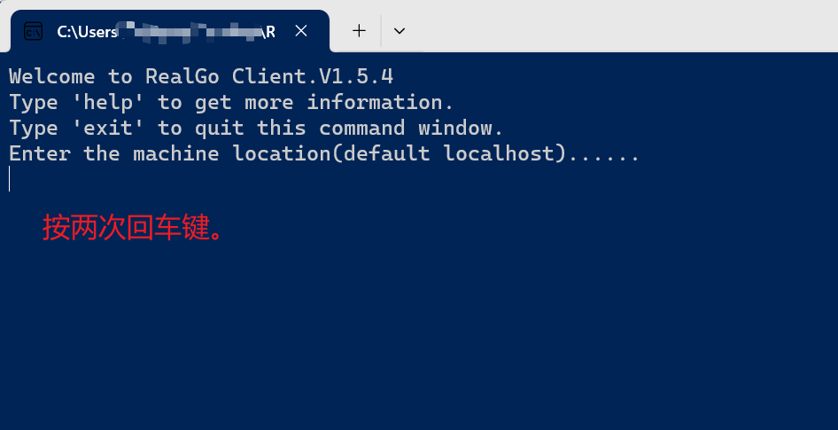
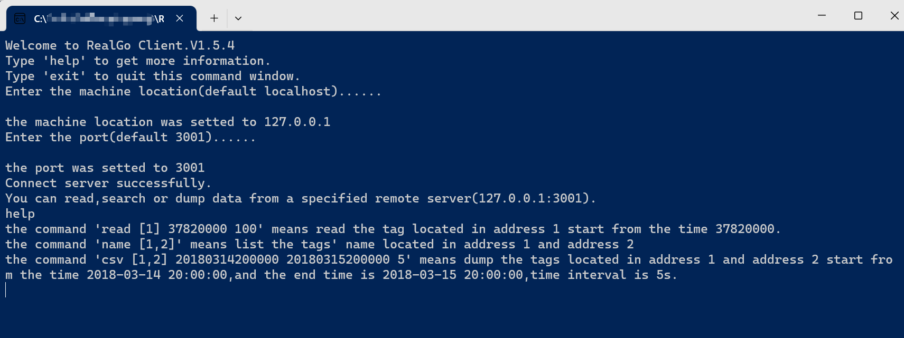

# Tai-Ji RealDB 1.8.2使用说明

## 安装

### 1. 获取压缩包

获取数据库压缩包，如 RealGoDB_v182_release.zip  
将压缩包解压至计算机上的目标位置。  
请注意，目标位置用于存储数据文件，建议预留足够空间。
  
### 2. 获取软件狗授权

从杭州泰极豫才软件有限公司（Taiji Control）获取软件授权。

### 3. 安装软件狗驱动

从.\RealGoDB_v182_release\Tools中找到HASPUserSetup.exe。  
根据提示安装驱动。

### 4. 软件狗检查

从.\RealGoDB_v182_release\Tools中找到HASPChecker.zip。  
解压缩后运行HASPChecker.exe，检查软件狗是否安装成功，以及确认授权信息。

### 5. 软件狗授权更改

从.\RealGoDB_v182_release\Tools中找到RUS_TJC.zip。  
解压后根据提示更改授权信息。  
更改授权需联系Taiji Control的技术人员。

## 使用

### 数据库的组成

数据库主要由一个数据库内核（Shell）一个数据采集以及趋势显示（DataViewer）组成。其它部件包括数据导出（DataExport）等。数据库的开启流程为：

- 启动数据库内核（Shell）
- 启动数据采集以及趋势显示（DataViewer）并开始采集数据

### 1. 数据库内核（Shell）

数据库内核（Shell）是数据库的核心部件，作为服务端执行数据库的启动、停止、数据存储、数据查询等功能。

数据库内核（Shell）通过.\RealGoDB_v182_release\RealGoDBGui.exe启动。启动后如下图所示，点击最小化按钮后，数据库内核（Shell）会在系统托盘中显示一个图标。数据库运行过程中一般不需要操作。


注意，数据库运行过程中不要关闭内核。

### 2. 数据采集（DataViewer）

数据采集以及趋势显示（DataViewer）是数据库的客户端部件，用于数据库的数据采集、数据趋势查看等功能。

数据采集通过OPC DA协议进行，需要OPC DA Server的IP地址以及OPC DA Server的ProgID。

请准备好需要采集的位号信息，所有位号需位于同一个OPC DA Server中。

数据采集以及趋势显示（DataViewer）通过.\RealGoDB_v182_release\DataViewer\DataViewer.exe启动。  
启动后如下图所示。


- 第一步，配置OPC服务器信息。

  点击“服务器设置”按钮，进入OPC设置界面。设置方法如下图所示。

  
  
  配置成功或失败均有对话框提示。

- 第二步，配置位号信息。

  准备**点表文件**，如下图所示。
  
  
  
  点表文件是一个以**逗号分隔**的**文本文件**，*第一列为数据库地址（DBID），第二列为显示名称，第三列为OPC服务器位号名，第四列为位号描述，第五、六列暂时保留。*
  
  点击“位号设置”按钮，进入位号设置界面。设置方法如下图所示。

  

- 注意，配置完成后，采集器不能关闭，否则数据采集将停止。

### 3. 数据趋势查看

- 点击DataViewer中的“数据浏览”，进入趋势查看界面。界面如下图所示。  
  
  

- DataViewer可以启动多个用于数据趋势浏览，只用于数据浏览的DataViewer不需要配置OPC服务器信息，亦可随时关闭。
  
### 3. 数据导出

  数据导出通过.\RealGoDB_v182_release\DataExport\DataExport.exe启动。  
  启动后如下图所示。  

  
  
  启动后按两次回车键，进入数据导出界面。键入help查看帮助信息。  

  

  通过类似于  

  ```text
  csv [1,2] 20180314200000 20180315200000 5
  ```

  命令导出DBID等于1和2在2018年3月14日20点到2018年3月15日20点之间的数据，时间间隔为5秒的csv文件。
